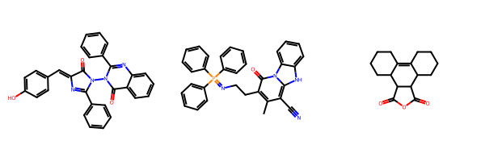

# HIV Inhibitor Prediction using Graph Neural Networks

Predicting whether a molecule can **inhibit HIV replication** using **Graph Neural Networks (GNN)** built with **PyTorch Geometric**.

This project converts molecules into **graph structures** and trains a **Graph Attention Network (GAT)** to perform **binary classification**:

- **1 → HIV inhibitor**
- **0 → Non-inhibitor**

The experiment tracking and model management are handled using **MLflow**.

The pipeline includes:

- Data processing  
- Graph construction  
- Model training  
- Experiment tracking with MLflow  
- Evaluation using multiple metrics  

---

# Project Overview

Drug discovery datasets often contain molecules represented as **SMILES strings**.

In this project:

- Molecules are converted into **graph representations**
- **Nodes represent atoms**
- **Edges represent chemical bonds**
- A **Graph Neural Network** learns structural patterns to classify molecules.

---

# Example Molecule Graph

Below is an example of how a molecule is represented as a graph.

Nodes represent **atoms** and edges represent **chemical bonds**.



---

# Model Architecture

The model uses a **Graph Attention Network (GAT)** implemented with **PyTorch Geometric**.

Main components:

- Node feature embedding
- Graph Attention layers
- TopK pooling
- Fully connected classification head
- Binary classification with **BCEWithLogitsLoss**

---

# Dataset

Dataset used: **HIV Dataset (MoleculeNet)**

The dataset contains molecules labeled based on their ability to **inhibit HIV replication**.

Typical molecular features include:

- Atom type  
- Atomic degree  
- Formal charge  
- Hybridization  
- Aromaticity  
- Bond type  

---

# Data Preprocessing

The preprocessing pipeline performs the following steps:

1. Convert **SMILES → Molecular Graph**
2. Extract **node features**
3. Extract **edge features**
4. Prepare dataset for **PyTorch Geometric**

---

# Running the Project

Run the notebooks in the following order.

## 1. Environment Setup

```
notebooks/00_setup.ipynb
```

Used to install and configure dependencies.

---

## 2. Create Dataset

```
notebooks/01_create_dataset.ipynb
```

This notebook:

- Loads the HIV dataset and remove invalid molecules
- create dataset for train_val and test
- Converts **SMILES strings to graph objects**
- Extracts **node and edge features**
- Builds a **PyTorch Geometric dataset**

---

## 3. Train the Model

```
runs.ipynb
```

This notebook performs:

- Model training
- Evaluation
- MLflow experiment tracking

---

# Libraries Used

Main libraries used in this project:

- **PyTorch**
- **PyTorch Geometric**
- **RDKit**
- **MLflow**
- **Scikit-learn**
- **Pandas**
- **NumPy**

Future integration:

- **DeepChem**

---

# Evaluation Metrics

The model is evaluated using the following metrics:

- **Precision**
- **Recall**
- **ROC-AUC**
- **Average Precision**

These metrics are more informative than accuracy due to the **high class imbalance** in the dataset.

---

# Handling Class Imbalance

The HIV dataset is **highly imbalanced**.

Strategies used to address this issue include:

- **Weighted loss using `pos_weight`**
- **Weighted Random Sampler**
---

# Experiment Tracking

All experiments are tracked using **MLflow**.

MLflow logs:

- Model parameters
- Training metrics
- Validation metrics
- Trained model artifacts


# Future Improvements

Possible improvements include:

- **Graph Transformer models**
- **Hyperparameter tuning with Optuna**
- **Advanced molecular feature extraction using DeepChem**
- **Better imbalance handling (Focal Loss)**

---

# Author

**Pasan Newinda**

Machine Learning / Deep Learning Projects
